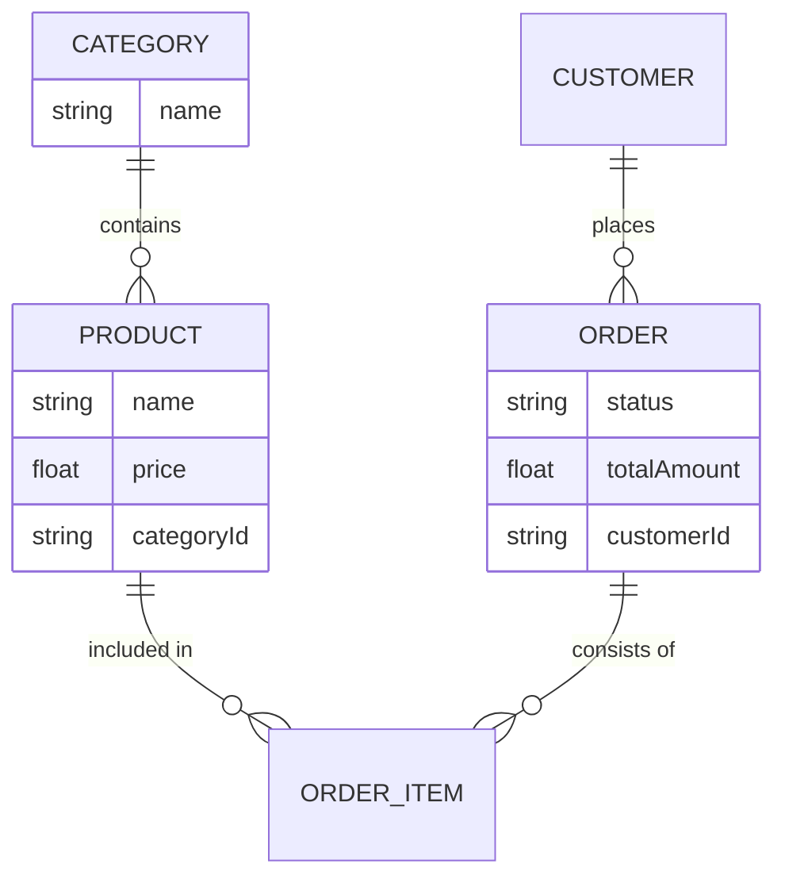
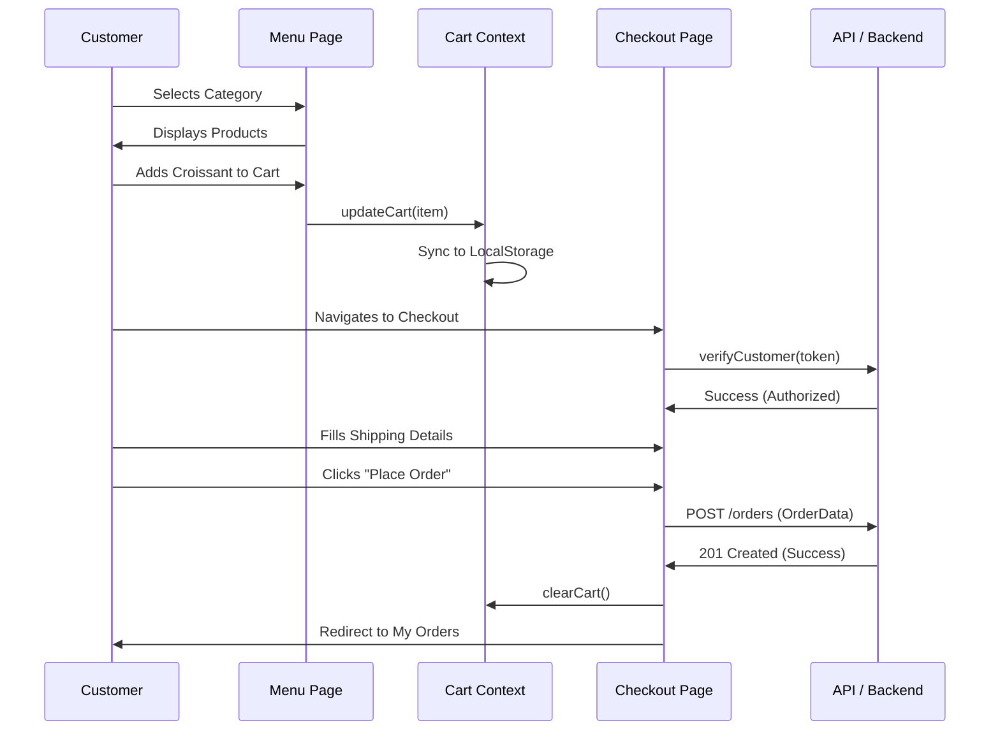
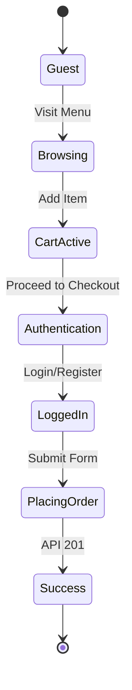

# Application Flow & Design Logic: Hatemalo Bakery
This document provides the technical logic and flow descriptions required to create formal diagrams (Use Case, ER, Sequence) for the internship report.

---

## 1. Actor & Use Case Analysis

### 1.1 Actors
*   **Guest User:** Unauthenticated visitor.
*   **Customer:** Authenticated user who can place orders.
*   **Administrator:** Shop owner who manages the platform.

### 1.2 Use Case Descriptions
| Actor | Use Case | Description |
|---|---|---|
| **Guest** | View Menu | Browses the bakery categories and products. |
| **Guest** | Add to Cart | Temporarily stores items in the browser. |
| **Guest** | Register | Creates a new customer account. |
| **Customer** | Login | Accesses their personalized account. |
| **Customer** | Checkout | Provides delivery details and places an order. |
| **Customer** | View Orders | Tracks the status of their previous purchases. |
| **Admin** | Dashboard | Views total sales metrics and counts. |
| **Admin** | Manage Products | CRUD operations for bakery treats. |
| **Admin** | Manage Orders | Updates status (Pending, Shipped, Delivered). |

### Use Case Diagram Logic (Mermaid)
```mermaid
useCaseDiagram
    actor Guest
    actor Customer
    actor Admin
    
    package "Hatemalo Bakery System" {
        usecase "Browse Menu" as UC1
        usecase "Manage Cart" as UC2
        usecase "Place Order" as UC3
        usecase "Track Orders" as UC4
        usecase "Manage Inventory" as UC5
        usecase "Control Orders" as UC6
    }
    
    Guest --> UC1
    Guest --> UC2
    Customer --> UC3
    Customer --> UC4
    Admin --> UC5
    Admin --> UC6
    Customer --|> Guest
```

---

## 2. Entity Relationship (ER) Logic
Although this is a frontend report, the data structure is critical for the ER diagram.

### Entities & Attributes
*   **Product:** `id`, `name`, `price`, `description`, `image`, `categoryId`.
*   **Category:** `id`, `name`, `icon`.
*   **Order:** `id`, `customerId`, `totalAmount`, `status`, `deliveryMethod`, `paymentMethod`.
*   **User/Customer:** `id`, `name`, `email`, `phone`, `address`.

### ER Diagram Logic (Mermaid)


---

## 3. Sequence Flow: The "Order Placement" Journey
This flow tracks a customer's journey from browsing to a successful order.

### Sequence Diagram Logic (Mermaid)


---

## 4. State Transition Flow
Describes how the application handles different states of the shopping cart and authentication.

### State Diagram Logic (Mermaid)


---

## 5. Summary of Application Routes
*   `/`: Dashboard / Hero.
*   `/menu`: Product catalog with filtering logic.
*   `/product/:id`: Deep dive into product details.
*   `/cart`: Review selected items.
*   `/checkout`: Secure form for delivery processing.
*   `/my-orders`: Customer's history.
*   `/admin/dashboard`: Business overview for controllers.
