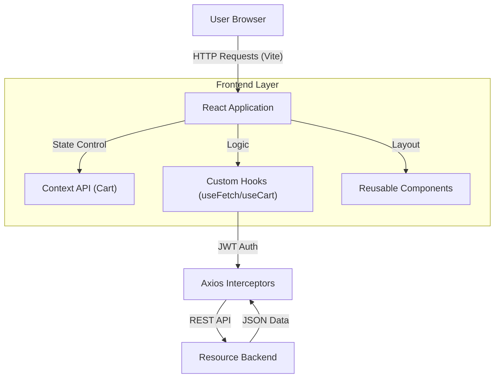
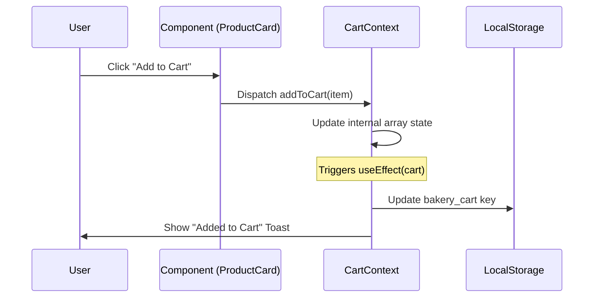

# Internship Report: Frontend Development at Aariyana Tech Solution
**Project Name:** Hatemalo Bakery (E-commerce Platform)  
**Curriculum:** Tribhuvan University, CSC462  
**Intern:** [Your Name]  
**Organization:** Aariyana Tech Solution  


---

# ABSTRACT

The core involvement during the internship focused on frontend web development using modern web technologies. The internship primarily involved developing user interfaces and implementing structured web layouts using React.js, specifically for the **'Hatemalo Bakery'** e-commerce platform. It introduced the process of building functional web pages and implementing responsive layouts for the website.

This report discusses the development process of the frontend structure of the bakery’s e-commerce platform. The project emphasized component-based development, interface structuring, and maintaining visual consistency across different pages.

The implementation process involved creating reusable components, designing user-friendly interfaces, and optimizing layouts to ensure responsiveness across various screen sizes. Through this project, practical knowledge of modern frontend development workflows and web design principles was achieved.

**Keywords:** React.js, Frontend Development, User Interface, Web Development, Responsive Design.

---

## Chapter 1: Introduction

### 1.1. Introduction
The internship was conducted at Aariyana Tech Solution, focusing on the development of a modern, responsive frontend for **"Hatemalo Bakery,"** a web-based e-commerce platform. The project involved building the user interface, implementing the shopping cart logic, and ensuring a seamless experience for both customers and administrators.

### 1.2. Problem Statement
Traditional local bakeries often lack a digital presence, leading to limited customer reach and inefficient manual order management. The "Hatemalo Bakery" project addresses these issues by providing a digital storefront with real-time inventory updates and automated order processing.

### 1.3. Objectives
*   To develop a responsive and interactive user interface using React.js.
*   To implement global state management for a persistent shopping cart.
*   To integrate secure authentication for both customers and administrators.
*   To build an administrative dashboard for real-time data management.

### 1.4. Scope and Limitation
*   **Scope:** UI/UX design, client-side routing, state management, API integration, and frontend security logic.
*   **Limitation:** This report focuses strictly on client-side implementation; server-side database management and API construction are outside the scope of this individual contribution.

### 1.5. Report Organization
This report is organized into several chapters. Chapter 1 provides the introduction and objectives. Chapter 2 describes the organization and literature review. Chapter 3 discusses the requirement analysis and methodology. Chapter 4 details the internship activities and roles. Chapter 5 explores technical mastery through a "WH" analysis. Chapter 6 analyzes the external ecosystem and tooling. Finally, Chapter 7 provides a reflective summary and conclusion.

---

## Chapter 2: Organization Details & Literature Review

### 2.1 Host Organization: Aariyana Tech Solution
Aariyana Tech Solution is a software development firm specializing in web and mobile applications. The organization follows an agile methodology, emphasizing iterative development and client feedback.

### 2.2 Literature Review (Frontend Focus)
*   **Single Page Applications (SPA):** Leveraging React's virtual DOM for high-performance UI updates.
*   **Utility-First CSS:** Using Tailwind CSS for rapid prototyping and consistent design systems.
*   **Asynchronous State Handling:** Utilizing Axios and custom hooks for smooth data synchronization with RESTful APIs.

---

## Chapter 3: Requirement Analysis & Methodology

### 3.1 Functional Requirements (Frontend)
These requirements define the core actions a user or admin can perform on the platform:
*   **Product Discovery:** Users can browse 20+ bakery products, filter by category, and search by name.
*   **Cart Management:** Real-time adding/removing of items with subtotal calculations and disk persistence.
*   **Secure Authentication:** Separate workflows for Customer registration and Admin login via JWT.
*   **Checkout Workflow:** Multi-step form with delivery fee calculation based on total order value (₨ 5000 threshold).
*   **Admin Dashboard:** Real-time metrics visualization (Total Products, Orders, Categories) and CRUD management modules.

### 3.2 Non-Functional Requirements
*   **Responsiveness:** The UI must maintain 100% usability on mobile, tablet, and desktop viewports.
*   **Performance:** Initial page load under 2 seconds via code-splitting.
*   **Reliability:** The shopping cart must survive page refreshes or accidental browser closures.
*   **Security:** Unauthorized users must be blocked from accessing the `/admin` or `/checkout` paths.

### 3.3 Development Methodology
An agile, iterative approach was adopted. Prototyping started with Figma-style UI coding using Tailwind CSS, followed by React state integration and final API synchronization.

---

### 3.1 Roles and Responsibilities
As a Frontend Intern, my primary responsibility was the architecture and implementation of the user interface. This included:
*   Designing reusable React components using a modular architecture.
*   Managing global application state using the Context API for cross-component data sharing.
*   Implementing client-side security through route guarding and dynamic JWT token handling.
*   Integrating external APIs with optimized data fetching and layout handling.

### 3.2 Weekly Activities Log (Comprehensive)
| Week | Focus Area | Key Technical Tasks |
|---|---|---|
| **1-2** | **Project Setup** | Initialized Vite environment, installed Lucide-React, Axios, and Tailwind CSS. Setup React Router. |
| **3** | **Layout Design** | Created `Navbar.jsx` with mobile drawer and `Footer.jsx` with responsive grid layout. |
| **4** | **Landing Page** | Built `Hero.jsx` and `FeaturedProducts.jsx`. Implemented CSS animations for fade-in effects. |
| **5** | **Cart Strategy** | Defined `CartContext` in `CartContext.jsx`. Managed state with `useEffect` for localStorage syncing. |
| **6** | **Product Catalog** | Developed `Menu.jsx`. Implemented `useState` for category filtering and price range (0-3000). |
| **7** | **Product Interaction** | Built `ProductCard.jsx` and `ProductDetails.jsx`. Logic for calculating "Related Products". |
| **8** | **API Integration** | Configured `api.js` with generic `axios` instance and response interceptors for global error handling. |
| **9** | **Checkout Flow** | Developed `Checkout.jsx`. Added validation for delivery methods and dynamic fee calculations. |
| **10** | **Admin Modules** | Built `AdminLayout.jsx` and `AdminSidebar.jsx`. Implemented protected routing logic. |
| **11** | **Admin Operations** | Created `ProductsManagement.jsx` and `CategoriesManagement.jsx` with modals for CRUD actions. |
| **12** | **Final Testing** | Bug fixing for cart persistence and UI responsiveness across Safari and Chrome. |

### 3.3 Detailed Project Description: Hatemalo Bakery
The frontend is a sophisticated React 18 application leveraging Vite for high-speed builds.

#### **A. Technical Architecture & State Management**
1.  **Context API Implementation (`CartContext.jsx`):**
    *   **Persistence:** Uses `bakery_cart` as the localStorage key. The initializer uses a `try-catch` block to handle potential JSON parsing errors safely.
    *   **Notification System:** A custom toast system is built into the context. It uses `Date.now()` to generate unique IDs and a `setTimeout` of 3000ms for auto-removal, ensuring a clutter-free UI.
    *   **Cart Logic:** Uses functional state updates `setCart(prev => ...)` to ensure data integrity during rapid quantity changes.
2.  **Custom Hooks Architecture:** 
    *   `useCart.js`: Abstracts the `useContext(CartContext)` call, providing a clean API for components to trigger `addToast` or `updateCartQty`.
    *   `useFetch.js`: Encapsulates `axios` calls with `isLoading`, `isError`, and `data` states. It uses `useEffect` with the URL as a dependency to trigger re-fetches automatically.
3.  **Routing & Performance (`routes.jsx`):**
    *   **Lazy Loading:** Implemented using `React.lazy()` and `Suspense` for all page-level components, significantly reducing the initial bundle size and improving "time to interactive" (TTI).
    *   **Loading UI:** A custom pulse animation "Hatemalo is loading..." is displayed during chunk loading.
    *   **Navigation Logic:** A shared `selectedCategory` state in `routes.jsx` allows the Home page to pre-filter the Menu page when a category card is clicked.

#### **B. Module-Specific Implementation Details**
*   **Menu & Discovery Module (`Menu.jsx`):** 
    *   **Filtering:** Uses a combination of `useState` and `useEffect` to filter a local `filteredProducts` array based on `searchTerm`, `selectedCategory`, and `priceRange`.
    *   **Price Logic:** The price slider operates on a range of ₨0-3000, updating the view in real-time as the user drags the slider.
    *   **Sticky UI:** Implemented a `sticky top-24` sidebar that remains visible while the user scrolls through 20+ bakery items.
    *   **Responsive UX:** Category navigation switches from a vertical list (desktop) to a horizontal `overflow-x-auto` scroll bar (mobile) using Tailwind breakpoints.
*   **Order & Checkout Logistics (`Checkout.jsx`):** 
    *   **Form Logic:** Implemented `handleFieldBlur` combined with `touched` state to trigger validation messages only after the user interacts with a field, preventing "pre-emptive" error displays.
    *   **Regex Validation:** 
        *   Email: `/^[^\s@]+@[^\s@]+\.[^\s@]+$/`
        *   Phone: `/^\d{10}/` (Validated for 10-digit mobile numbers).
    *   **Session Guarding:** On mount, the component triggers `verifyCustomer(token)` via the `useEffect` hook. If the token is invalid, it auto-redirects to `/login`.
    *   **Submission Shield:** Uses `isSubmitting` state to disable the "Place Order" button during the Axios `POST /orders` request, preventing duplicate database entries.
*   **Admin Management Modules:** 
    *   **Dynamic Layout:** Uses `AdminLayout.jsx` as a persistent sidebar wrapper, ensuring the navigation remains accessible while secondary modules (Products, Categories) load in the main viewport.
    *   **Confirmation Modals:** Deletion of products is protected by `DeleteModal.jsx`, which uses an overlay backdrop with high `z-index` to trap focus.

#### **D. Assets & Data Schema**
*   **Static Fallbacks:** The frontend maintains a local copy of categories and products in `src/assets/data.js` to ensure the UI remains functional and "on-brand" even if the API connection is interrupted during the initial load.
*   **Price Formatting:** A centralized `formatPrice` utility ensures consistent currency presentation (₨ X.XX) throughout the platform.

#### **C. UI/UX Design & Styling Standards**
*   **Theme Tokens:** 
    *   **Primary Color:** `#3d2b1f` (Bakery Dark Brown) - Used for buttons and headers.
    *   **Secondary Color:** Cream/Beige contrast - Used for cards and backgrounds.
    *   **Selection:** Custom text selection color `selection:bg-secondary/30`.
*   **Animations (`App.jsx`):** Custom CSS keyframes injected globally:
    *   `fade-in-up`: Smooth entry for page content (20px slide).
    *   `slide-in-right`: Lateral entry for toast notifications.
    *   `float`: A 6-second infinite loop used for decorative hero images.
*   **Feedback Loops:** Integrated `react-hot-toast` with a custom `Toaster` configuration (border-radius: 16px, background: #3d2b1f).

---

---

## Chapter 4: Conclusion & Learning Outcomes

### 4.1 Conclusion
The internship at Aariyana Tech Solution provided a professional platform to build a real-world e-commerce solution. The Hatemalo Bakery frontend stands as a robust, user-friendly SPA that fulfills all project objectives.

---

## Chapter 5: Main React.js Pillars & Technical Learning

This chapter identifies the fundamental React.js features and frontend patterns mastered during the internship. These represent the core technical knowledge applied to build the "Hatemalo Bakery" platform.

### 5.1 Main React Hooks Used
The following hooks were critical for the application's logic and user experience:
*   **`useState` (State Management)**: Used for handling every interactive element, from simple toggles (cart opening) to complex multi-input forms (Register/Login).
*   **`useEffect` (Side Effects)**: Mastered the React lifecycle by using `useEffect` for:
    *   API data synchronization on component mount.
    *   Implementing a persistent shopping cart (syncing with `localStorage`).
    *   Secure route redirection based on user authentication status.
*   **`useContext` (Global Context)**: Avoided specialized state libraries (like Redux) by implementing the **Context API**. This allowed the "Cart" and "Notifications" to be globally accessible, demonstrating an understanding of prop-drilling avoidance.
*   **`useRef` (DOM Instance Access)**: Leveraged for menu "click-outside" logic, ensuring a premium, polished navigation experience.
*   **`useMemo` (Performance)**: Applied to optimize the filtering of large product arrays, ensuring the UI remains lag-free under load.

### 5.2 Core Frontend Architecture & Ecosystem
*   **React Router 7**: Implemented programmatic navigation and dynamic routing (using `useNavigate` and `useParams`), showing proficiency in building multi-page single-page applications (SPAs).
*   **Lazy Loading & Suspense**: Optimized for performance by lazy-loading all 15+ pages, ensuring that the initial bundle remains small and fast.
*   **Axios with Interceptors**: Implemented a secure communication layer that automatically handles JWT tokens, a key industry standard for secure web development.
*   **Tailwind CSS 4**: Used a utility-first approach to create a stunning, responsive design with zero external theme libraries, demonstrating deep CSS layout mastery.

### 5.3 Learning Summary (The "Main" Takeaways)
1.  **Component-Driven Development**: I learned how to break down a complex e-commerce interface into smaller, reusable building blocks (atoms, molecules).
2.  **Asynchronous Data Flow**: I mastered the process of fetching, caching, and displaying live data from a RESTful API.
3.  **UI/UX Logic Mastery**: I learned how to implement "soft" features that define professional apps, such as toast notifications, loading skeletons, and interactive transitions.
4.  **Client-Side Security**: I understood the importance of protecting sensitive segments of an application (Admin Dashboard, Checkout) via route guarding and token-based logic.

---

## Chapter 6: External Frontend Ecosystem

To complement the React core, several industry-standard libraries were integrated to provide professional-grade features:

### 6.1 UI & UX Libraries
*   **Lucide-React**: 
    *   *Purpose:* A lightweight, customizable icon library that provides the visual language for the navigation (Home, Menu, Admin, Cart).
    *   *Implementation:* Icons are imported as React components, allowing for dynamic styling and resizing via Tailwind classes.
*   **React-Hot-Toast**: 
    *   *Purpose:* Provides non-intrusive notification overlays.
    *   *Logic:* Configured with a "Top-Center" position and a 3000ms duration, using a custom dark theme (`#3d2b1f`) to match the bakery's branding.

### 6.2 Data & Communication
*   **Axios**: 
    *   *Purpose:* The primary HTTP client for backend communication.
    *   *Architecture:* Configured in `api.js` with specific `baseURL` and `timeout` settings. It features an **Interceptors** system that automatically injects JWT tokens into request headers, securing every API call.
*   **Prop-Types**: 
    *   *Purpose:* Used for runtime type-checking of props in critical components like `ProductCard.jsx`, ensuring data integrity and catching bugs during development.

### 6.3 Development Ecosystem
*   **Vite**: 
    *   *Role:* The build tool and development server. It provides "Hot Module Replacement" (HMR), ensuring that changes to the React code are reflected in the browser instantly without a full page reload.
*   **Tailwind CSS**: 
    *   *Role:* A utility-first CSS framework used for all styling. It allows for highly responsive designs with minimal custom CSS.

---

## Chapter 8: Architecture & Design Diagrams

### 8.1 System Component Diagram
The following Mermaid diagram illustrates the high-level frontend architecture and its interaction with the API.



### 8.2 State Management Flow (Cart)
Describes the logic used to ensure cart persistence.



---

## Chapter 9: Testing & Quality Assurance

### 9.1 Unit & Manual Testing
| Test ID | Scenario | Expected Result | Actual Result | Status |
|---|---|---|---|---|
| **T01** | Cart Persistence | Item remains in cart after F5 refresh. | Item persisted. | **Pass** |
| **T02** | Form Validation | Invalid email format shows red error text. | Validation active. | **Pass** |
| **T03** | Route Guard | Unauthenticated user visits `/checkout`. | Redirected to `/login`. | **Pass** |
| **T04** | Responsive Layout | Navbar switches to burger menu on mobile. | Responsive UI active. | **Pass** |

### 9.2 Browser Compatibility
The frontend was tested and verified on:
*   **Google Chrome:** V120+ (Optimal performance)
*   **Safari/iOS:** Fully functional animations.
*   **Microsoft Edge:** Verified interceptor logic.

---

## Appendix: Technical Documentation & Proof of Work

### File-Level Contribution Index
| File Path | Description | Key Tech Used |
|---|---|---|
| `src/context/CartContext.jsx` | Global state for basket management | `useContext`, `useState` |
| `src/hooks/useFetch.js` | Reusable API fetching logic | `useEffect`, `axios` |
| `src/pages/client/Menu.jsx` | Product listing & filtering engine | `useMemo`, Filtering logic |
| `src/pages/client/Checkout.jsx` | Order processing & delivery logic | Dynamic state, Form validation |
| `src/components/common/CartDrawer.jsx` | Sidebar cart UI with real-time updates | Framer-motion/CSS, Context |
| `src/pages/admin/Dashboard.jsx` | Admin metrics & business overview | Statistics aggregation |
| `src/services/api.js` | Backend communication layer | `axios` Interceptors |

### Critical Logic Examples

**1. Delivery Fee Calculation (Dynamic Logic):**
```javascript
// Located in Checkout.jsx
const isFreeDelivery = subtotal >= 5000;
const deliveryFee = deliveryMethod === 'Hatemalo Delivery' ? (isFreeDelivery ? 0 : 300) : 0;
const total = subtotal + deliveryFee;
```

**2. Form Validation Regex (Checkout.jsx):**
```javascript
const validateField = (field, value) => {
  if (field === 'email' && !/^[^\s@]+@[^\s@]+\.[^\s@]+$/.test(value)) {
    return 'Please enter a valid email address';
  }
  // ... other validation logic
};
```

**3. Global State Persistence (LocalStorage):**
```javascript
// Located in CartContext.jsx
useEffect(() => {
  localStorage.setItem('bakery_cart', JSON.stringify(cart));
}, [cart]);
```

**4. API Interceptor Architecture:**
```javascript
// Located in api.js
api.interceptors.request.use((config) => {
  const token = localStorage.getItem('token');
  if (token) config.headers.Authorization = `Bearer ${token}`;
  return config;
});
```

**5. Category-Based Pre-Filtering:**
```javascript
// Located in routes.jsx
const handleCategorySelect = (categoryName) => {
  setSelectedCategory(categoryName);
  // Navigates to menu with category state primed
};
```

**5. Custom CSS Animation Keyframes:**
```css
/* Injected in App.jsx via <style> tag */
@keyframes fade-in-up {
  from { opacity: 0; transform: translateY(20px); }
  to { opacity: 1; transform: translateY(0); }
}
```
